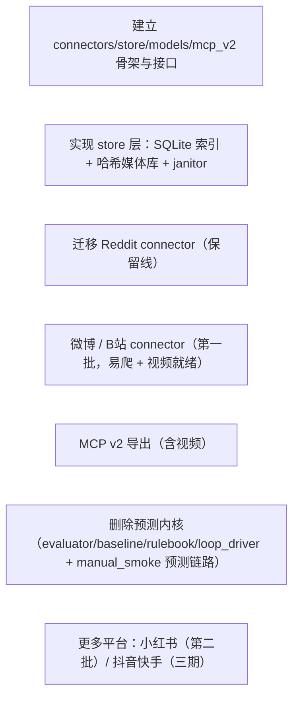

<!-- phase:task skill:taiyi-task gate:auto est:15min produces:TASK.md upstream:[design,requirement] downstream:[dev,test] cplx:[ALL]2steps +[M+]2 +[H]1 -->
# TASK: news_harness 架构评审：从 harness 转向国内爆款搬运工具

> **总Slice**: — | **预估**: — | **并行**: —

---

## Step 1: Dependency Graph
> **[ALL]** Goal: 一眼看清依赖 | Inputs: DESIGN.md
<!-- Action: Mermaid图，箭头=依赖 -->

<!-- Validate: 无循环依赖 -->

---

## Slices

> **[ALL]** Goal: 每个Slice独立可交付 | Inputs: Step1+DESIGN.md §5
<!-- Action: 每个Slice=独立PR，含文件清单/验证命令/验收点/依赖/并行性/Completeness -->

### Slice S1: 建立 connectors/store/models/mcp_v2 骨架与接口
> **[ALL]** | ⇧ 无 | ⇶ ❌须顺序 | Score: 7/10

创建 connectors/（base.py + registry.py）、store/（db/media/cache/janitor）、models.py（ContentItem）、mcp_v2.py 的包结构与接口定义，空实现 + 类型契约，不接真实抓取。

**read_files**（只读 · 不写）:
- `news_harness/__init__.py`
- `news_harness/cli.py`
- `AGENTS.md`

**write_files**（写边界 · 不越界）:
<!-- R7.3 强约束: 不碰禁动清单，不顺手改其他文件 -->
- `news_harness/connectors/__init__.py`
- `news_harness/connectors/base.py`
- `news_harness/connectors/registry.py`
- `news_harness/store/__init__.py`
- `news_harness/store/db.py`
- `news_harness/store/media.py`
- `news_harness/store/cache.py`
- `news_harness/store/janitor.py`
- `news_harness/models.py`
- `news_harness/mcp_v2.py`

**验证**: `python3 -m pytest tests/test_models.py tests/test_connector_contract.py`

**物理锚点**（git-diff 确认 write_files 已被实际修改）:
> 🪝 `git diff --name-only`

**验收点**:
- ⬜ Connector 接口（fetch_feed/fetch_by_url→ContentItem）定义齐全
- ⬜ 所有新包可 import，无循环依赖
- ⬜ ContentItem 字段表有单测覆盖

<!-- Validate: 可独立merge/deploy？文件范围精确？ -->

---

### Slice S2: 实现 store 层：SQLite 索引 + 哈希媒体库 + janitor
> **[ALL]** | ⇧ Slice S1 | ⇶ ❌须顺序 | Score: 8/10

db.py 落 SQLite 元数据索引（去重/发布状态/历史）；media.py 内容哈希去重落盘 + manifest；janitor 按配额/TTL/LRU 清理，refcount=0 即删。

**read_files**（只读 · 不写）:
- `news_harness/store/db.py`
- `news_harness/store/media.py`
- `news_harness/store/janitor.py`

**write_files**（写边界 · 不越界）:
<!-- R7.3 强约束: 不碰禁动清单，不顺手改其他文件 -->
- `news_harness/store/db.py`
- `news_harness/store/media.py`
- `news_harness/store/janitor.py`

**验证**: `python3 -m pytest tests/test_store.py`

**物理锚点**（git-diff 确认 write_files 已被实际修改）:
> 🪝 `git diff --name-only`

**验收点**:
- ⬜ 写入去重生效（相同内容只存一份）
- ⬜ janitor 配额/TTL/LRU 清理生效
- ⬜ 媒体哈希去重，manifest 记录 size/refcount/last_accessed/rights_status

<!-- Validate: 可独立merge/deploy？文件范围精确？ -->

---

### Slice S3: 迁移 Reddit connector（保留线）
> **[ALL]** | ⇧ Slice S1 | ⇶ ✅可并行 | Score: 8/10

把 manual_smoke/direct_cli_backend 的 Reddit 抓取逻辑迁移为 connectors/reddit.py，保留现有凭证/auth，输出统一 ContentItem。

**read_files**（只读 · 不写）:
- `news_harness/direct_cli_backend.py`
- `news_harness/manual_smoke.py`

**write_files**（写边界 · 不越界）:
<!-- R7.3 强约束: 不碰禁动清单，不顺手改其他文件 -->
- `news_harness/connectors/reddit.py`

**验证**: `python3 -m pytest tests/test_reddit_connector.py`

**物理锚点**（git-diff 确认 write_files 已被实际修改）:
> 🪝 `git diff --name-only`

**验收点**:
- ⬜ Reddit fetch_feed 返回规范 ContentItem
- ⬜ 现有 NEWS_HARNESS_* 凭证/auth 路径不变

<!-- Validate: 可独立merge/deploy？文件范围精确？ -->

---

### Slice S4: 微博 / B站 connector（第一批，易爬 + 视频就绪）
> **[ALL]** | ⇧ Slice S1 | ⇶ ✅可并行 | Score: 7/10

实现 connectors/weibo.py（m.weibo.cn JSON）与 connectors/bilibili.py（api.bilibili.com + WBI 签名），注册表可按平台名发现。

**read_files**（只读 · 不写）:
- `news_harness/connectors/base.py`
- `news_harness/connectors/registry.py`

**write_files**（写边界 · 不越界）:
<!-- R7.3 强约束: 不碰禁动清单，不顺手改其他文件 -->
- `news_harness/connectors/weibo.py`
- `news_harness/connectors/bilibili.py`

**验证**: `python3 -m pytest tests/test_weibo_connector.py tests/test_bilibili_connector.py`

**物理锚点**（git-diff 确认 write_files 已被实际修改）:
> 🪝 `git diff --name-only`

**验收点**:
- ⬜ 两平台 fetch_feed 返回规范 ContentItem（含 media[] 图文/视频）
- ⬜ registry 按名发现并启用

<!-- Validate: 可独立merge/deploy？文件范围精确？ -->

---

### Slice S5: MCP v2 导出（含视频）
> **[ALL]** | ⇧ Slice S1,S2 | ⇶ ❌须顺序 | Score: 8/10

artifact_api 扩展 mcp_v2：McpExportItem 增加 author/video_refs/media_kind；升 schemas/v2/mcp_export_item.schema.json；保持白名单 + 禁令牌测试。

**read_files**（只读 · 不写）:
- `news_harness/artifact_api.py`
- `schemas/v1/mcp_export_item.schema.json`

**write_files**（写边界 · 不越界）:
<!-- R7.3 强约束: 不碰禁动清单，不顺手改其他文件 -->
- `news_harness/mcp_v2.py`
- `schemas/v2/mcp_export_item.schema.json`
- `news_harness/artifact_api.py`

**验证**: `python3 -m pytest tests/test_mcp_export.py`

**物理锚点**（git-diff 确认 write_files 已被实际修改）:
> 🪝 `git diff --name-only`

**验收点**:
- ⬜ 导出含 video_refs / author / media_kind
- ⬜ forbidden-keys 测试仍过（secret 不外泄）
- ⬜ MCP 保持只读

<!-- Validate: 可独立merge/deploy？文件范围精确？ -->

---

### Slice S6: 删除预测内核（evaluator/baseline/rulebook/loop_driver + manual_smoke 预测链路）
> **[ALL]** | ⇧ Slice S3,S4,S5 | ⇶ ❌须顺序 | Score: 9/10

移除 harness 预测/评估/回访相关模块与 manual_smoke 中对应链路，仅留抓取骨架。

**read_files**（只读 · 不写）:
- `news_harness/evaluator.py`
- `news_harness/baseline.py`
- `news_harness/rulebook.py`
- `news_harness/loop_driver.py`
- `news_harness/manual_smoke.py`

**write_files**（写边界 · 不越界）:
<!-- R7.3 强约束: 不碰禁动清单，不顺手改其他文件 -->
- `news_harness/manual_smoke.py`

**验证**: `python3 -m news_harness validate fixtures`

**物理锚点**（git-diff 确认 write_files 已被实际修改）:
> 🪝 `git diff --name-only`

**验收点**:
- ⬜ harness 预测代码不再被任何模块引用
- ⬜ validate fixtures 仍过
- ⬜ 旧文件可 git revert 回滚

<!-- Validate: 可独立merge/deploy？文件范围精确？ -->

---

### Slice S7: 更多平台：小红书（第二批）/ 抖音快手（三期）
> **[ALL]** | ⇧ Slice S4 | ⇶ ❌须顺序 | Score: 6/10

实现 connectors/xiaohongshu.py（x-s/x-t 签名）；抖音/快手反爬方案成熟后接 connectors/douyin.py。

**read_files**（只读 · 不写）:
- `news_harness/connectors/base.py`
- `news_harness/connectors/registry.py`

**write_files**（写边界 · 不越界）:
<!-- R7.3 强约束: 不碰禁动清单，不顺手改其他文件 -->
- `news_harness/connectors/xiaohongshu.py`

**验证**: `python3 -m pytest tests/test_xhs_connector.py`

**物理锚点**（git-diff 确认 write_files 已被实际修改）:
> 🪝 `git diff --name-only`

**验收点**:
- ⬜ 小红书 fetch_feed 返回规范 ContentItem
- ⬜ 抖音反爬方案验证通过后再接

<!-- Validate: 可独立merge/deploy？文件范围精确？ -->

---

## Checklist per slice

- [ ] 测试先行（RED）— 每个 Slice 先写失败测试
- [ ] 最小实现（GREEN）— 让测试通过
- [ ] 重构（REFACTOR）— 不改变行为
- [ ] Done when includes npm test command
- [ ] 更新追溯（REQUIREMENT AC ↦ 测试用例）

## Step 3: Execution Plan
> **[MEDIUM+]** Goal: 分Wave并行执行 | Inputs: Step2
<!-- Action: 按依赖图分组，无依赖的同Wave并行 -->

### Wave 1 (基础)
- S1: 建立骨架与接口契约
### Wave 2 (依赖 S1, 可并行)
- S2: 实现 store 存储层
- S3: 迁移 Reddit connector
- S4: 微博/B站 connector
### Wave 3 (依赖 S1/S2)
- S5: 实现 MCP v2 导出
### Wave 4 (依赖 S3/S4/S5)
- S6: 删除预测内核模块
### Wave 5 (依赖 S4)
- S7: 接入更多内容平台

<!-- Validate: 每Wave内部确实无依赖？ -->

## Step 4: Risk per Slice
> **[MEDIUM+]** Goal: 每个Slice风险独立评估 | Inputs: Step2+DESIGN.md §6
<!-- Action: Slice→风险→概率→缓解 -->

| Slice | 风险 | 概率 | 缓解 |
|-------|------|------|------|
| S2 | janitor 误删未发布媒体 | 低 | TTL/refcount 双保护 + 删除前只读快照 |
| S3 | Reddit 抓取逻辑回归 | 中 | 保留旧 direct_cli_backend 可回滚 |
| S4 | 反爬触发封号 | 中 | 限速/退避/配置化 |
| S6 | 误删仍在用代码 | 低 | 先留 deprecated 标记再删 |

<!-- Validate: 高风险Slice有独立回滚？ -->

## Step 5: Rollback per Slice
> **[HIGH]** Goal: 每个Slice可独立安全回退 | Inputs: Step4
<!-- Action: 回滚方式+预计时间+数据影响 -->

| Slice | 回滚方式 | 时间 | 数据影响 |
|-------|---------|------|---------|
| S1 | git revert | ≤5 min | 无数据影响 |
| S2 | git revert + 删 media 库目录 | ≤15 min | 媒体库为新增，删除即可 |
| S3 | git revert | ≤5 min | 无 |
| S4 | git revert | ≤5 min | 无 |
| S5 | git revert | ≤5 min | schema v2 为新增 |
| S6 | git revert | ≤10 min | 无 |
| S7 | git revert | ≤10 min | 无 |

<!-- Validate: 每个Slice可独立回滚？数据一致性？ -->

> 📎 **SSOT 规则**: 切片风险基于 [DESIGN.md §Blast Radius](DESIGN.md) 细分，不回重新评估。切片回滚基于 [CHANGE.md](CHANGE.md) 的 rollback_{trigger,ops,time} 做切片级适配（≤5min/md-only）。
>
> 📎 **多 Slice 并行模式**: 若变更拆为多个可并行发版的 Slice（对应独立 PR），每个 Slice 可生成独立的 `TEST-{slice}.md` 和 `REVIEW-{slice}.md`（ultrawork 模式）。宏观的 TEST.md / REVIEW.md 仅作为阶段级摘要；CI 流式合并以 Slice 级 TEST / REVIEW 为门控单元。

---
## Quality Gate
<!-- Evidence-first: 每个Slice可独立验证交付。cognitive#13: 先重构再实现，不把结构+行为放同一个PR -->

- [ ] S1 依赖图无循环
- [ ] S2 每个Slice可独立交付
- [ ] S2 每个Slice有 read_files/write_files + 验证 + 验收点
- [ ] S2 每个Slice有Completeness评分
- [ ] [M+] S3 Wave分波合理
- [ ] [M+] S4 每Slice风险已评估
- [ ] [H]  S5 每Slice有独立回滚
- [ ] **PITFALLS.md**: 已扫描触达模块的 PITFALLS（`.pitfalls/scan.sh --module <path>` + 人工 grep 关键词），无已知踩坑或已声明规避方案
- [ ] **项目上下文**: 已查 PHASE-CONTEXT.md 既有抽象索引，无重复实现
- [ ] **Refactor-first**: 重构PR和功能PR分开了？(Rule: make change easy, then make easy change)
